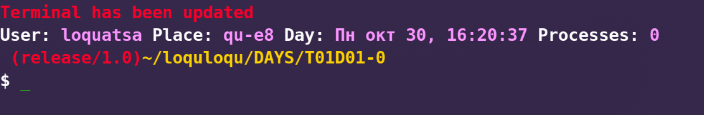

# S21_swim_script
Personal script for peers at School 21 for *unix systems (Linux / MacOS)

**Write to install the command below**

***curl -l https://raw.githubusercontent.com/Sovsemo/S21_swim_script/main/.zshrc > ~/.zshrc ; source ~/.zshrc ; init_setup***

NR       - get the last stable release

info_bas - simple view contents branch name and directory

info_ext - extended view with userdata

restart  - restart terminal if something unexpected happened

comp     - accept *.c file and compiles it with all flags checked & running at the same time

**Example of terminal view with extended view for userdata**

**To delete use following command**

rm ~/.zshrc
